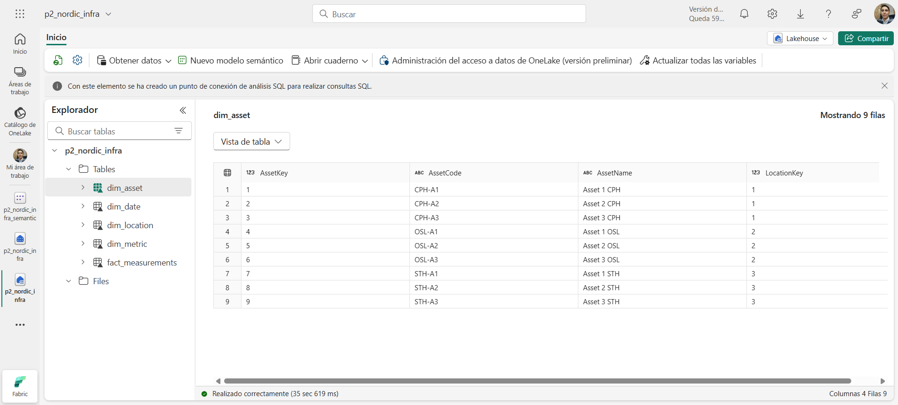

# Nordic Infra Sustainability — v0.9

**Resumen:** Energía, CO2e, retraso y costo por ciudad con vista ejecutiva y página What‑if.

**Demo pack**
- [One-pager (PDF)](media/one-pager_v0.9_en.pdf)
- [GIF 90s](media/demo-90s_v0.9.gif)

## Problema
Unificar en un solo dashboard la comparación plan vs real y el impacto por ciudad/activo.

## Dataset (sintético)
- `DimDate`, `DimLocation`, `DimAsset`, `DimMetric`; `FactMeasurements` con `PlanValue` y `ActualValue`.
- Generado con `/python/generate_synthetic_data.py`.

## Modelo en estrella
Ver `/docs/model-star.mmd` (Mermaid) y miniatura en `/assets/thumbnails/`.

## KPIs
Energía (kWh), CO2e (t), Retraso (días), Costo (moneda local), Costo por kWh, Variación %.

## Medidas DAX
Lista completa en `/measures/DAX.md`.

## Cómo ejecutar
1) Clonar repo. 2) (Opcional) `python -m pip install -r python/requirements.txt`.
3) Ejecutar `python/generate_synthetic_data.py` para (re)generar CSVs en `/data/synthetic/`.
4) Abrir PBIX y conectar a `/data/synthetic/*.csv`. 5) Marcar `DimDate[Date]` como tabla de fechas.

## So‑what de negocio
Detectar desviaciones por ciudad/activo y evaluar escenarios simples con un slider.

## Limitaciones
Datos sintéticos, Fabric/Dataflows opcional, costos en una sola moneda.

## Ruta Fabric (incluida)

Este repo incluye una configuración mínima en Microsoft Fabric para gobernanza y reutilización:

- **Lakehouse**: `p2_nordic_infra` con 5 tablas Delta (`dim_date`, `dim_location`, `dim_asset`, `dim_metric`, `fact_measurements`).
- **Modelo semántico**: `p2_nordic_infra_semantic` (relaciones 1:*, `Date` marcada como tabla de fechas, medidas DAX según `/measures/DAX.md`).
- **Reporte thin**: conectado en vivo al modelo semántico (sin datos/modelo dentro del PBIX).

**Linaje:** Lakehouse → Modelo semántico → Reporte thin.  
**Capturas:**  
  

**Notas**
- Direct Lake sobre tablas Delta (no requiere refresh de dataset para cambios en el modelo).
- Si luego agregas Dataflows Gen2, agenda su ejecución; el reporte thin tomará los cambios vía el modelo semántico.

## Hoja de ruta a v1.0
Accesibilidad, refinamiento de What‑if, publicación y notas de refresh.

## Licencia
Código MIT, datos CC BY 4.0.