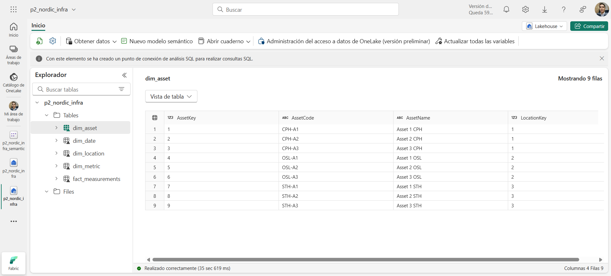
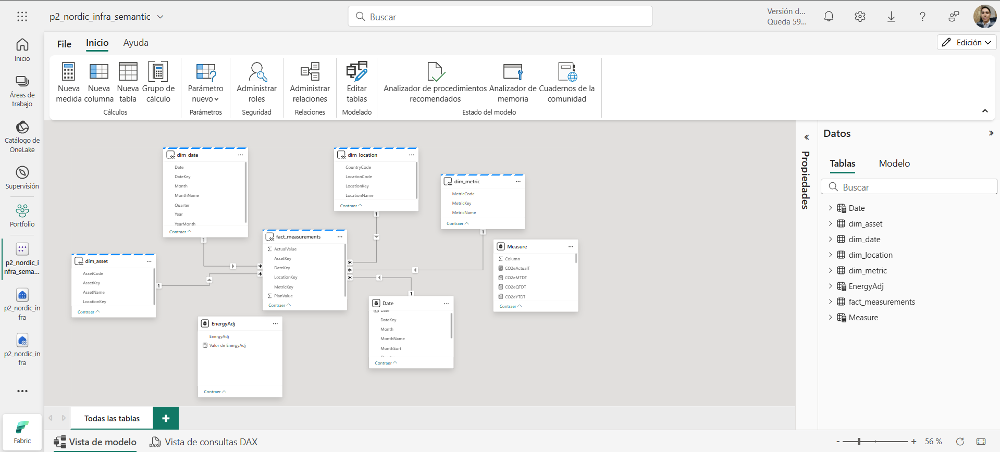
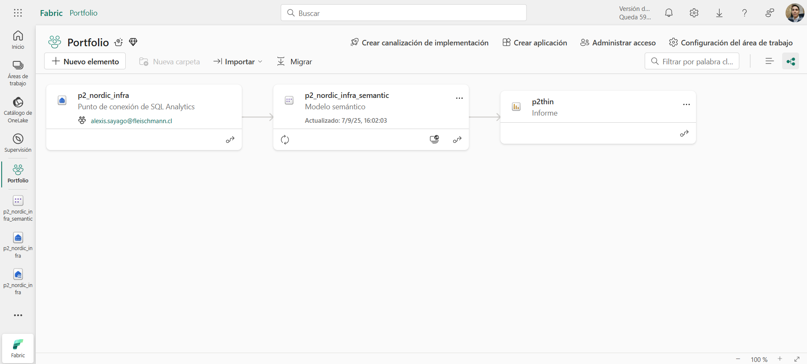

# Nordic Infra Sustainability — v0.9

**One‑liner:** Energy, CO2e, delay and cost by city (CPH/STH/OSL) with an executive view and a What‑if page.

**Demo pack**
- [One-pager (PDF)](media/one-pager_v0.9_en.pdf)
- [GIF 90s](media/demo-90s_v0.9.gif)

## Problem
Executives need a single place to compare energy/CO2e vs plan and understand delays/cost per city/asset.

## Dataset (synthetic)
- `DimDate`, `DimLocation`, `DimAsset`, `DimMetric`; `FactMeasurements` with `PlanValue` and `ActualValue`.
- Generated with `/python/generate_synthetic_data.py` (seeded). See **Data dictionary**.

## Star schema
  
See `/docs/model-star.mmd` for Mermaid source.

## KPIs
- Energy (kWh), CO2e (t), Delay (days), Cost (local), Cost per kWh, Variance % (plan vs actual).

## DAX measures
See `/measures/DAX.md` for full list (base measures, metric‑scoped, YTD/MTD/QTD).

## How to run
1) Clone repo. 2) Run `python/python -m pip install -r python/requirements.txt` (optional).
3) Run `python/generate_synthetic_data.py` to (re)generate CSVs in `/data/synthetic/`.
4) Open the PBIX, connect to `/data/synthetic/*.csv`. 
5) Mark `DimDate[Date]` as date table. Validate relationships (single direction). 6) Export one‑pager PDF.

## Business so‑what
Faster variance detection at city/asset level; supports scenario analysis via slider.

## Limitations
Synthetic data only; Fabric/Dataflows optional; costs shown in a single local currency.

## Fabric path (included)

This repo also ships a minimal Microsoft Fabric setup for governance and reuse:

- **Lakehouse**: `p2_nordic_infra` with 5 Delta tables (`dim_date`, `dim_location`, `dim_asset`, `dim_metric`, `fact_measurements`).
- **Semantic model**: `p2_nordic_infra_semantic` (1:* relationships, `Date` marked as Date table, DAX measures aligned with `/measures/DAX.md`).
- **Thin report**: connected live to the semantic model (no data/model inside the PBIX).

**Lineage:** Lakehouse → Semantic model → Thin report.  
**Screenshots:**  
  

**Notes**
- Direct Lake over Delta tables (no dataset refresh required for model changes).
- If you add Dataflows Gen2 later, schedule them; the thin report will pick up updates via the semantic model.

## Roadmap to v1.0
- Add accessibility checks, refine What‑if, publish to Service and document refresh.

## License
Code under MIT, data under CC BY 4.0.